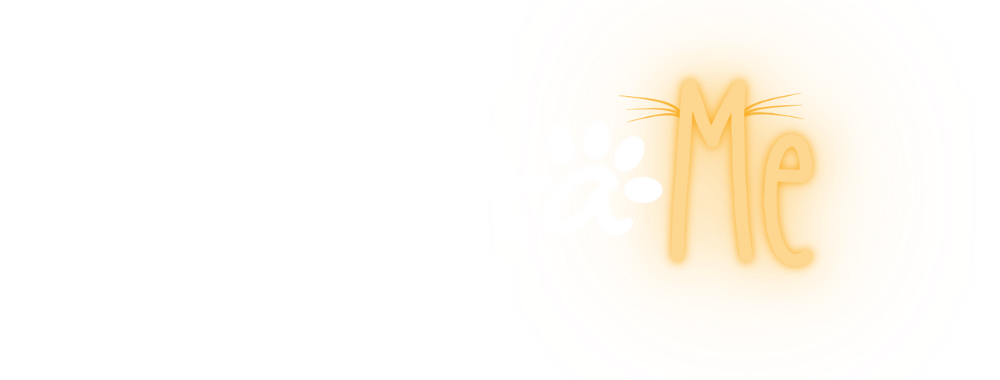

   

# Índice

* [Crear un usuario](#crear-un-usuario)
* [Obtener los usuarios por ID](#obtener-los-usuarios-por-id)
* [Obtener los usuarios](#obtener-los-usuarios)
* [Actualizar Usuarios](#actualizar-usuarios)
* [Login](#login)
* [Obtener todos los paises](#obtener-todos-los-paises)
* [Obtener ciudades por pais](#obtener-ciudades-por-pais)
* [Crear una mascota](#crear-una-mascota)
* [Obtener mascotas](#obtener-mascotas)
* [Obtener mascota por ID](#obtener-mascota-por-id)
* [Actualizar una mascota por ID](#actualiza-una-mascota-por-id)
* [Obtener tipos de mascotas](#obtener-tipos-de-mascotas)
* [Obtener tipos y razas de mascotas](#obtener-tipos-y-razas-de-mascotas)
* [Obtener razas de mascotas por ID del tipo de mascota](#obtener-razas-de-mascotas-por-id-tipo-de-mascota)
* [Obtener un numero de resultados random de mascotas](#obtener-un-numero-de-resultados-random-de-mascotas)
* [Email de verificacion de usuario](#email-de-verificacion-de-usuario)
* [Verificacion de usuario](#verificacion-de-usuario)
* [Email de recuperacion de contraseña](#email-de-recuperacion-de-contraseña)
* [Modificacion de contraseña por recuperacion](#modificacion-de-contraseña-por-recuperacion)
* [Envio de email automatizado](#envio-de-emails-automatizado)

# Crear un usuario

### Request

`POST /user/`

    https://restapi-adoptame.up.railway.app/api/v1.0/user

### Response

    HTTP/1.1 201 Created

    {"message": "User Created Successfully!, If you solicited a verification of fundation the state is pending"}

## Obtener los usuarios

### Request

`GET /user/users`

    bearer: token

    https://restapi-adoptame.up.railway.app/api/v1.0/user/users

### Response

    HTTP/1.1 200

    [
      {
      "id": id,
      "name": "nombre",
      "lastName": "lastName",
      "email": "email",
      "role": "role",
      "active": true,
      "donaciones": 0,
      "address": "address",
      "phone": "",
      "document": null,
      "countryId": "CHL",
      "cityId": 580
      }
    ]

## Obtener los usuarios por id

### Request

`GET /user/users/{id}`

    bearer: token

    https://restapi-adoptame.up.railway.app/api/v1.0/user/{id}

### Response

    HTTP/1.1 200

    {
      "id": id,
      "name": "nombre",
      "lastName": "lastName",
      "email": "email",
      "role": "role",
      "active": true,
      "donaciones": 0,
      "address": "address",
      "phone": "",
      "document": null,
      "countryId": "CHL",
      "cityId": 580
    }
    
## Actualizar Usuarios

### Request

`PUT /user/{id}/`

    bearer: token

    https://restapi-adoptame.up.railway.app/api/v1.0/user/{id}

### Response

    HTTP/1.1 201

    { message: "Updated!" }

## LOGIN

### Request

`POST /auth/userLogin/`

    {
      "email": "example@test.com",
      "password": "mypassword"
    }

    https://restapi-adoptame.up.railway.app/api/v1.0/auth/userLogin/

### Response

    HTTP/1.1 201

    {
      "token": token,
      "user": {
          "id": 1,
          "name": "juancito",
          "lastName": "Benalcazar",
          "email": "example@test.com",
          "role": "user"
      }
    }

## Obtener todos los paises

### Request

`GET /countries/`

    https://restapi-adoptame.up.railway.app/api/v1.0/countries/

### Response

    HTTP/1.1 200

    [
      {
          "id": "ARG",
          "name": "Argentina"
      },
      {
          "id": "CHL",
          "name": "Chile"
      },
      {
          "id": "COL",
          "name": "Colombia"
      },
      {
          "id": "ECU",
          "name": "Ecuador"
      },
      {
          "id": "PER",
          "name": "Peru"
      }
    ]

## Obtener ciudades por pais

### Request

`GET /cities/{idCountry}`

    https://restapi-adoptame.up.railway.app/api/v1.0/cities/{idCountry}

### Response

    HTTP/1.1 200

    [
      {
          "id": 1,
          "name": "28 de Noviembre",
          "countryId": "ARG"
      },
      {
          "id": 2,
          "name": "Abasto",
          "countryId": "ARG"
      },
      {
          "id": 3,
          "name": "Acassuso",
          "countryId": "ARG"
      },
      {
          "id": 4,
          "name": "Acebal",
          "countryId": "ARG"
      },
      {
          "id": 5,
          "name": "Acevedo",
          "countryId": "ARG"
      },
      {...}
    ]

## Crear una Mascota

### Request

      Content-Type: multipart/form-data
      Bearer: token

    {
        "userId": 1,
        "name": "name pet",
        "typeId": "dog",
        "breedId": 2,
        "typeHair": "short",
        "specialCares": false,
        "castrated": false,
        "gender": "male",
        "environment": {
            "children": true,
            "dogs": null,
            "cats": null
        },
        "tags": [
            "friendly",
            "affectionate"
        ],
        "size": "medium",
        "color": "marron",
        "age": "young",
        "health": "vaccinations up to date",
        "description": "description pet",
        "status": "adoptable",
        "photos": []
    }

`POST /pets/`

    https://restapi-adoptame.up.railway.app/api/v1.0/pets

### Response

    HTTP/1.1 201 Created

    {
      "data": {
          "userId": 1,
          "name": "name pet",
          "typeId": "dog",
          "breedId": 2,
          "typeHair": "short",
          "specialCares": false,
          "castrated": false,
          "gender": "male",
          "environment": {
              "children": true,
              "dogs": null,
              "cats": null
          },
          "tags": [
              "friendly",
              "affectionate"
          ],
          "size": "medium",
          "color": "marron",
          "age": "young",
          "health": "vaccinations up to date",
          "description": "description pet",
          "status": "adoptable",
          "photos": []
      },
      "message": "successfully created pet"
    }

## Obtener Mascotas

### Request

`GET /pet/`

    https://restapi-adoptame.up.railway.app/api/v1.0/pets/

### Response

    HTTP/1.1 200

    [
      {
        "id": 72352,
        "type": "dog",
        "name": "Lilliana",
        "typeHair": "kinky",
        "specialCares": true,
        "castrated": false,
        "gender": "male",
        "environment": {
          "children": false,
          "dogs": null,
          "cats": false
        },
        "tags": [
          "quiet",
          "affectionate",
          "smart",
          "protective"
        ],
        "size": "extra large",
        "color": "Skittles",
        "age": "young",
        "published_at": "2022-07-05",
        "health": "no vaccines",
        "description": "Consequuntur sunt saepe ab nobis nihil numquam quia est rem. Eveniet est numquam voluptatum impedit aut. Est repellat occaecati ut commodi. Voluptas debitis hic. Reprehenderit eos aliquam vel esse.\nUt quisquam voluptatem expedita exercitationem. Quis aliquid in. Nostrum ullam aut quis provident error cum nostrum et.\nNon qui dolorem rerum sed ducimus. Voluptas eum repudiandae culpa. Omnis ut consequatur dolores.",
        "photos": [
          [
            "https://images.dog.ceo/breeds/hound-ibizan/n02091244_879.jpg",
            "https://images.dog.ceo/breeds/maltese/n02085936_6892.jpg",
            "https://images.dog.ceo/breeds/terrier-norwich/n02094258_3036.jpg"
          ]
        ],
        "status": "adoptable",
        "userId": 1,
        "breed": "borzoi",
        "city": "Des Moines",
        "address": "04434 Gislason Forest"
      },
      {
        "id": 8933,
        "type": "dog",
        "name": "Ludie",
        "typeHair": "kinky",
        "specialCares": false,
        "castrated": true,
        "gender": "male",
        "environment": {
          "children": null,
          "dogs": false,
          "cats": null
        },
        "tags": [
          "smart",
          "affectionate"
        ],
        "size": "medium",
        "color": "Tiger",
        "age": "adult",
        "published_at": "2022-07-02",
        "health": "vaccinations up to date",
        "description": "Porro aut dolores debitis et. Sequi porro ut dolorum accusamus et explicabo. Laborum perspiciatis vel molestias quo omnis et.\nUt eos impedit ipsam deserunt doloremque tempora recusandae quam. Est sapiente ut nisi sit laudantium doloribus. Laborum ipsum tenetur eum sint hic hic eveniet qui. Quo et non. Eum sunt modi rem aperiam cum omnis iure reprehenderit molestiae. Nesciunt cum deleniti magnam ad et tenetur ipsam ipsa optio.\nQui vitae voluptas modi reprehenderit ut ad nesciunt distinctio accusamus. Eius omnis modi. Maxime id aut ipsam. Consequatur possimus et tempora et. Ipsa fugit sed neque nostrum. Dolores perferendis beatae provident recusandae qui.",
        "photos": [
          
        ],
        "status": "adopted",
        "userId": 3,
        "breed": "groenendael",
        "city": "Long Beach",
        "address": "648 Gusikowski Corner"
      },
      { ... }
    ]

## Obtener Mascota por id

### Request

`GET /pet/`

    https://restapi-adoptame.up.railway.app/api/v1.0/pets/{id}

### Response

    HTTP/1.1 200

    {
      "id": 72352,
      "type": "dog",
      "name": "Lilliana",
      "typeHair": "kinky",
      "specialCares": true,
      "castrated": false,
      "gender": "male",
      "environment": {
        "children": false,
        "dogs": null,
        "cats": false
      },
      "tags": [
        "quiet",
        "affectionate",
        "smart",
        "protective"
      ],
      "size": "extra large",
      "color": "Skittles",
      "age": "young",
      "published_at": "2022-07-05",
      "health": "no vaccines",
      "description": "Consequuntur sunt saepe ab nobis nihil numquam quia est rem. Eveniet est numquam voluptatum impedit aut. Est repellat occaecati ut commodi. Voluptas debitis hic. Reprehenderit eos aliquam vel esse.\nUt quisquam voluptatem expedita exercitationem. Quis aliquid in. Nostrum ullam aut quis provident error cum nostrum et.\nNon qui dolorem rerum sed ducimus. Voluptas eum repudiandae culpa. Omnis ut consequatur dolores.",
      "photos": [
        [
          "https://images.dog.ceo/breeds/hound-ibizan/n02091244_879.jpg",
          "https://images.dog.ceo/breeds/maltese/n02085936_6892.jpg",
          "https://images.dog.ceo/breeds/terrier-norwich/n02094258_3036.jpg"
        ]
      ],
      "status": "adoptable",
      "userId": 1,
      "breed": "borzoi",
      "city": "Des Moines",
      "address": "04434 Gislason Forest"
    }

## Actualiza una Mascota por id

### Request

      Content-Type: multipart/form-data
      Bearer: token

    {
        "userId": 1,
        "name": "name pet",
        "typeId": "dog",
        "breedId": 2,
        "typeHair": "short",
        "specialCares": false,
        "castrated": false,
        "gender": "male",
        "environment": {
            "children": true,
            "dogs": null,
            "cats": null
        },
        "tags": [
            "friendly",
            "affectionate"
        ],
        "size": "medium",
        "color": "marron",
        "age": "young",
        "health": "vaccinations up to date",
        "description": "description pet",
        "status": "adoptable",
        "photos": [],
        "urlPhotosDb": []
    }

`PUT /pets/{id}`

    https://restapi-adoptame.up.railway.app/api/v1.0/pets/id

### Response

    HTTP/1.1 201 Created

    {
      "data": {
          "userId": 1,
          "name": "name pet",
          "typeId": "dog",
          "breedId": 2,
          "typeHair": "short",
          "specialCares": false,
          "castrated": false,
          "gender": "male",
          "environment": {
              "children": true,
              "dogs": null,
              "cats": null
          },
          "tags": [
              "friendly",
              "affectionate"
          ],
          "size": "medium",
          "color": "marron",
          "age": "young",
          "health": "vaccinations up to date",
          "description": "description pet",
          "status": "adoptable",
          "photos": []
      },
      "message": "successfully updated pet"
    }

## Obtener tipos de mascotas

### Request

`GET /type-pet/`

    https://restapi-adoptame.up.railway.app/api/v1.0/type-pet/

### Response

    HTTP/1.1 200

    [
      {
          "id": "dog",
          "name": "dog"
      },
      {
          "id": "cat",
          "name": "cat"
      }
    ]

## Obtener tipos y razas de mascotas

### Request

`GET /breed-pet/`

    https://restapi-adoptame.up.railway.app/api/v1.0/breed-pet/

### Response

    HTTP/1.1 200

    [
      {
          "id": 1,
          "name": "affenpinscher",
          "typeId": "dog"
      },
      {
          "id": 2,
          "name": "african",
          "typeId": "dog"
      },
      {
          "id": 103,
          "name": "Arabian Mau",
          "typeId": "cat"
      },
      {
          "id": 104,
          "name": "Australian Mist",
          "typeId": "cat"
      },
      {
          "id": 105,
          "name": "Balinese",
          "typeId": "cat"
      },
      {...}
    ]

## Obtener razas de mascotas por id tipo de mascota

### Request

`GET /breed-pet/{idTipoMascota}`

    https://restapi-adoptame.up.railway.app/api/v1.0/breed-pet/{idTipoMascota}

### Response

    HTTP/1.1 200

    [
      {
          "id": 1,
          "name": "affenpinscher",
          "typeId": "dog"
      },
      {
          "id": 2,
          "name": "african",
          "typeId": "dog"
      },
      {
          "id": 3,
          "name": "airedale",
          "typeId": "dog"
      },
      {
          "id": 4,
          "name": "akita",
          "typeId": "dog"
      },
      {
          "id": 5,
          "name": "appenzeller",
          "typeId": "dog"
      },
      {...}
    ]

## Obtener un numero de resultados random de mascotas 

### Request

`GET /dataPetsFake/{results}`

    https://restapi-adoptame.up.railway.app/api/v1.0/dataPetsFake/2

### Response

    HTTP/1.1 200

    [
      {
        "id": 29885,
        "type": "cat",
        "name": "Vida",
        "typeHair": "short",
        "specialCares": true,
        "castrated": false,
        "gender": "female",
        "environment": {
          "children": null,
          "dogs": true,
          "cats": null
        },
        "tags": [
          "friendly"
        ],
        "size": "small",
        "color": "Spot",
        "age": "senior",
        "published_at": "2022-07-07",
        "health": "vaccinations up to date",
        "description": "Similique dolor ea ducimus eum consequatur sequi nisi. Non minima quo perspiciatis qui autem. Molestias eius sed beatae earum animi nihil et. Aut laudantium est cumque similique expedita facere earum. Est eos aliquam.\nEa qui commodi nemo neque et. Dolor explicabo illo sit. Odio perspiciatis tempora officia nulla quae fugiat in qui molestiae. Velit odio ut voluptates accusantium. Qui et aut quidem non hic aut aut sunt aut.\nDignissimos cumque aliquam id id. Vel aut deserunt id molestiae quia. Veritatis quisquam officia vero mollitia et pariatur sunt ab quia.",
        "photos": [
          [
            "https://loremflickr.com/640/480/cats",
            "https://loremflickr.com/640/480/cats",
            "https://loremflickr.com/640/480/cats",
            "https://loremflickr.com/640/480/cats",
            "https://loremflickr.com/640/480/cats"
          ]
        ],
        "status": "adopted",
        "userId": 9,
        "breed": "Oriental",
        "city": "Orem",
        "address": "544 Greenfelder Fields"
      },
      {
        "id": 75599,
        "type": "cat",
        "name": "Myrtle",
        "typeHair": "hairless",
        "specialCares": true,
        "castrated": true,
        "gender": "female",
        "environment": {
          "children": false,
          "dogs": false,
          "cats": null
        },
        "tags": [
          "quiet",
          "protective"
        ],
        "size": "extra large",
        "color": "Tuxedo",
        "age": "senior",
        "published_at": "2022-06-30",
        "health": "vaccinations up to date",
        "description": "Quia maiores asperiores non. Ea et qui consequatur quas consequatur sit. Eaque provident non officia in ut doloribus. Voluptate et natus veniam blanditiis temporibus adipisci laborum. Id labore quis mollitia enim et ut.\nQuia reiciendis est quibusdam sequi sed vel recusandae. Voluptatum nesciunt voluptatum. Non esse ex ea impedit. Ipsa occaecati reiciendis maxime minus voluptatibus ullam. Aperiam esse id voluptatem quia quod libero corporis blanditiis. Nostrum ut aliquid qui laudantium amet vel est sit architecto.\nEos et ipsam impedit quod laborum odit. Est fugiat explicabo molestiae. Eius minus quia veniam qui maiores.",
        "photos": [
          [
            "https://loremflickr.com/640/480/cats",
            "https://loremflickr.com/640/480/cats",
            "https://loremflickr.com/640/480/cats",
            "https://loremflickr.com/640/480/cats"
          ]
        ],
        "status": "adopted",
        "userId": 7,
        "breed": "Somali",
        "city": "Santa Monica",
        "address": "629 Krajcik Loaf"
      }
    ]

# Email de verificacion de usuario

## request

  `POST /verify`

  https://restapi-adoptame.up.railway.app/api/v1.0/verify

  {
    "email" : "correro@correo.com"
  }

## response

     {
      "msg": "send email"
     }

# Verificacion de usuario

## request

   `GET /verify/tk/{token}`

   https://restapi-adoptame.up.railway.app/api/v1.0/verify/tk/{token}

## response

    {
      "msg": "verified email"
    }

# Email de recuperacion de contraseña

## request

  `POST /verify/recpass`

     https://restapi-adoptame.up.railway.app/api/v1.0/verify/recpass

    {
    "email" : "correro@correo.com"
    }

## response

    {
      "msg": "send email"
    }

# Modificacion de contraseña por recuperacion

## request

  `PUT /verify/modpass/{token}`

  https://restapi-adoptame.up.railway.app/api/v1.0/verify/modpass/{token}

     {
     "password1": "password",
     "password2": "password"
     }

## response

    {
     "msg": "updated password"
    }

# envio de emails automatizado

NT: solo el from, info y email son obligatorios, el resto es opcional (se puede dejar en blanco o directamente no poner los opcionales)

## request

  `POST /auto`

  https://restapi-adoptame.up.railway.app/api/v1.0/auto

    {
    "from": "Quien lo envia",
    "to": "email@correo.com",
    "subject": "asunto o razon (si no se pone se enviara lo mismo que el from)",
    "titulo": "titulo del texto (si no se pone se enviara lo mismo que el from)",
    "info": "informacion",
    "button": {
        "link": "un link de redireccion (si no se envia link, el boton no aparecera)",
        "text": "texto del boton (este es opcional para el boton, si no se pone tendra por defecto 'click here')"
              }
    }

#  